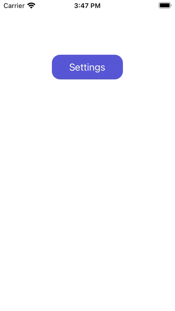

# HalfModalViewController



## Installation

### Cocoapods
1. Add `pod 'HalfModalViewController'` to your *Podfile*. 
2. Install the pod(s) by running `pod install`. If you are having issues on M1, then do `arch -x86_64 pod install`
3. Add `import HalfModalViewController` in the .swift files where you want to use it

If you have issues with using the HalfPageModalViewController class, please make sure you have the latest version as of the writing of this (1.0.1)

## Basic Usage
After installing, the framework works similar to any other UIViewController. The difference is that any asset added, whether it is a button, table, or label,  will need to be added to the `containerView` of the object. Below is an example:

```swift
override func viewDidLoad() {
      let halfViewController = HalfPageModalViewController()
      let button = UIButton()
      
      button.setTitle("Settings", for: .normal)
      button.backgroundColor = .systemIndigo
      button.layer.cornerRadius = 15

      self.view.addSubview(button)
      button.translatesAutoresizingMaskIntoConstraints = false
      button.widthAnchor.constraint(equalToConstant: 130).isActive = true
      button.heightAnchor.constraint(equalToConstant: 45).isActive = true
      button.topAnchor.constraint(equalTo: self.view.topAnchor, constant: 100).isActive = true
      button.centerXAnchor.constraint(equalTo: self.view.centerXAnchor).isActive = true
      button.addTarget(self, action: #selector(settingsClicked), for: .touchUpInside)
}

@objc func settingsClicked(){
    halfViewController.modalPresentationStyle = .overCurrentContext
    self.present(halfViewController, animated: false, completion: nil)
}

```

Additionally, it is extremely important that when you present the half modal view controller, you set `modalPresentationStyle` to `.overCurrentContext`. This will ensure that the view controller is presented correctly on screen. Additionally, there is no need for any animations when you call `self.present` as the view controller already has animations.

## Customization Properties
* `defaultHeight`: Default height of the container. Default value is 350, but can be changed.
* `dismissibleHeight`: Height at which the view will be dismissed when dragging. Default value is 200, but can be changed.
* `maxmimumContainerHeight`: Maximum height that the container will go to when dragging up. Default value is the size of the screen minus thirty-three, but can be changed.

## Updates
- `08/22/2021` Updated Cocoapods so the HalfPageModalViewController class is public. Cocoapods should be fully operational.
- `08/15/2021` Added source files and published Cocoapods

## Lessons Learned
* As a follow-up to my DropDownButton, I continued to familiarize myself with Git and creating Cocoapods.
